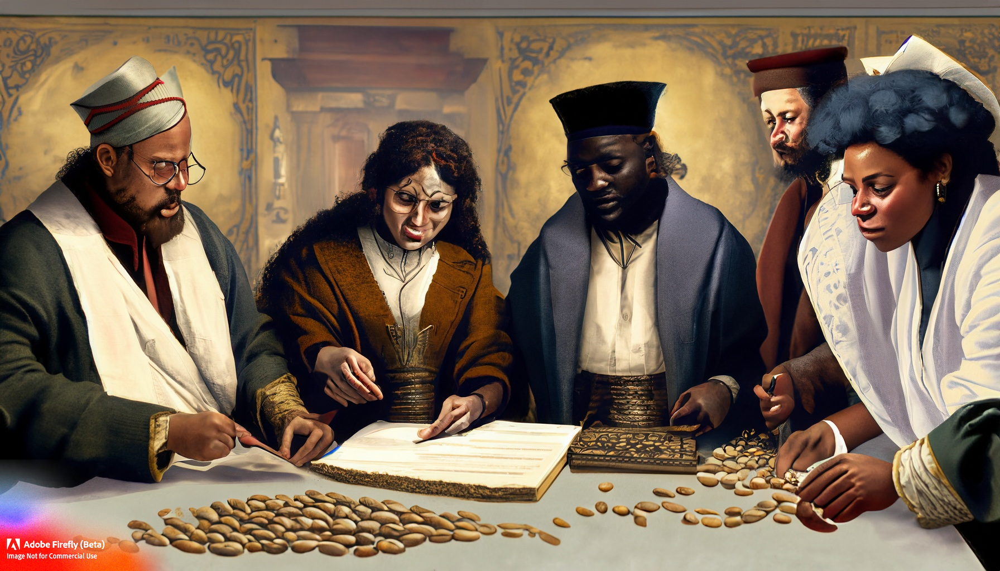

# CER &middot; BEANS: Community Engaged Research Balanced Expressions and Assessments with Nuanced Scores

CER &middot; BEANS is a framework for developing quantitative metrics for community engaged research (CER) that is balanced, nuanced, and expressive. It is a work in progress, and your feedback and contributions are welcomed.
